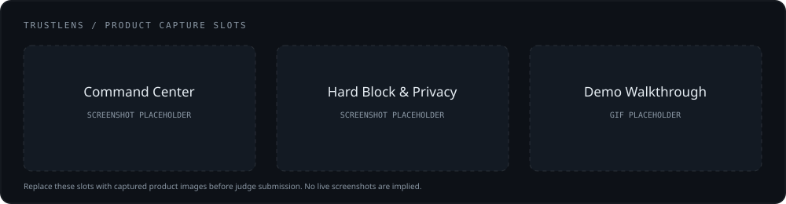
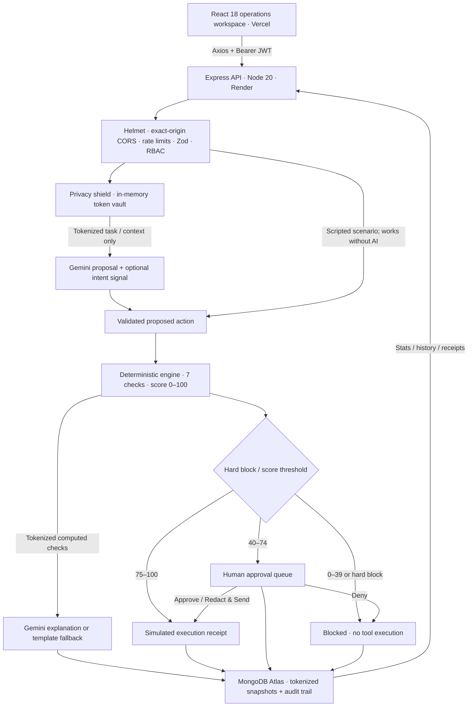

# TrustLens

**A firewall for AI agents — every action verified before it happens.**


TrustLens sits between an AI agent's proposed action and its execution. It checks permissions, sensitive data, recipients, destinations, behavior, policy, and intent — then executes a simulated tool, queues human review, or blocks the action.

> **The score is computed by deterministic code; the LLM never grades itself.**

## Live links & demo account

| Destination | Status |
| --- | --- |
| Vercel client | Pending account deployment — publish the verified URL here |
| Render API / `/health` | Pending account deployment — publish the verified URL here |
| Local client | http://localhost:5173 |
| Local API health | http://localhost:5000/health |
| Source repository | https://github.com/hkaatipelly-ui/trustlens |
| Demo credentials | **`demo@trustlens.app` / `Demo@1234`** |

Live URLs are added after deployment and end-to-end verification. The local and explicit mock demos are available now.

### Screenshots & demo GIF



Capture slots (replace the placeholder with product captures before submission):

| Asset | Suggested file | Capture |
| --- | --- | --- |
| Command Center | `docs/media/command-center.png` | Trust totals, activity chart, recent decisions |
| Agent Console | `docs/media/hard-block.png` | HR permission breach: high score + HARD BLOCK |
| Approval / Outbox | `docs/media/redact-and-send.png` | Redacted receipt containing `<PHONE_1>` |
| Demo GIF | `docs/media/demo.gif` | Normal → Grey → Redact & Send → Injection → Permission |

## The problem

AI agents now act on company data. They send emails, share files, read databases, post messages, and call URLs. A fluent answer is no longer the only outcome: an agent can move real data across a real trust boundary.

- **Prompt injection:** a hidden instruction in an email or document can redirect an agent from the user's task to a harmful action.
- **Data leakage:** customer Aadhaar, PAN, phone numbers, and payment details can reach a model or an external recipient.
- **Permission creep:** an HR agent can attempt to read finance records even when a user asks it to.
- **Opaque decisions:** trusting an agent's own “this is safe” explanation offers no independent enforcement.

India's **Digital Personal Data Protection Act, 2023** provides for penalties up to **₹250 crore** for failure to take reasonable security safeguards. TrustLens demonstrates an enforceable action boundary and privacy-first model interaction; it is not a compliance certification.

## The solution: four decisions

| Decision | Condition | What happens |
| --- | --- | --- |
| **TRUSTED** | Score **75–100**, no hard block | Auto-execute the simulated tool; write an OutboxItem |
| **SUSPICIOUS** | Score **40–74**, no hard block | Queue for **Approve / Deny / Redact & Send** |
| **UNSAFE** | Score **0–39**, no hard block | Block execution; retain the inspection trail |
| **HARD BLOCK** | Permission or critical policy violation, **at any score** | Block execution; display **HARD BLOCK — overrides score** |

A score of **93** does **not** grant an HR agent access to finance data. Hard blocks cannot be approved away.

All tools are **simulated**. “Send email” writes a database receipt. No real email, Slack message, file transfer, or external URL call occurs.

## How the Trust Score works

The unchanged engine in `server/src/lib/trustEngine.js` starts at **100** and subtracts explicit, capped penalties:

```text
score = clamp(100 − sum(check penalties), 0, 100)
decision = hardBlock ? BLOCKED : threshold(score)
```

| # | Check | Deterministic penalties / override |
| --- | --- | --- |
| 1 | **Agent permission** | Tool or data class outside the agent's scope → **hard block**. No numeric subtraction is needed. |
| 2 | **Sensitive data** | Per detected type: SECRET 30, Aadhaar 25, card 20, PAN 15, UPI 8, GSTIN 5, phone 5, email 3, IFSC 3, person 2. Personal-data volume adds 5 for 6–20 records or 10 for >20. Internal-use penalty is halved and rounded. **Cap 40.** |
| 3 | **Recipient** | Internal/no recipient 0; approved partner 10; unknown external 25; personal mailbox/blocked destination 35. **Cap 35.** |
| 4 | **Destination trust** | Consumer mailbox 10; unverified domain 15; blocked domain or look-alike impersonation 30; unencrypted HTTP adds 10. **Cap 30.** |
| 5 | **Behavior baseline** | Unusual tool 5; new external recipient/domain 8; volume >1.5× baseline 4 or >3× baseline 7. **Cap 20.** |
| 6 | **Company policy** | Bulk external share >10 records 15; personal email 20; outside 8am–8pm 5. **Cap 35.** Aadhaar leaving `acme.in` → **hard block**. |
| 7 | **Intent alignment** | Aligned/not supplied 0. Misalignment subtracts `round(30 × confidence)`, bounded **5–30**. **Cap 30.** |

Sensitivity weights apply once per entity type, not once per occurrence. Occurrence counts are retained separately for privacy reporting and volume checks. Individual penalties can add up beyond 100; the final score is clamped.

**The LLM never grades itself.** Gemini has exactly three roles:

1. Propose an action for a free-text task.
2. Supply one bounded signal: whether the proposal matches the user's intent.
3. Explain the **already-computed** checks in plain English.

Its explanation cannot change the score, permissions, or execution status. The server validates proposed actions with Zod. Scripted scenarios retain their scripted proposals even when Gemini is available.

## Privacy shield: the LLM never sees raw personal data

`server/src/lib/detector.js` detects and replaces Indian personal data before model requests:

| Entity | Detection / validation |
| --- | --- |
| Aadhaar | 12-digit candidates with **Verhoeff checksum** validation |
| PAN | Indian PAN format |
| Payment card | Card-number candidates with **Luhn checksum** validation |
| GSTIN | GSTIN format and **mod-36 checksum** |
| UPI / IFSC | Payment-handle and bank-code patterns |
| Phone / email | Indian phone and email patterns |
| Names | Name heuristics and supported coreference, e.g. a full name and later surname |

```text
Raw, server memory:  Rahul Sharma, <a valid Aadhaar>, <a phone number>
Sent to the LLM:     <PERSON_1>, <AADHAAR_1>, <PHONE_1>
```

- Tasks, agent/resource metadata, context documents, proposals, and computed checks are tokenized at model-service boundaries and again at the provider boundary.
- Token vaults stay in **server memory**. They are never returned, logged, or persisted.
- Proposal tokens are restored in server memory for email/domain validation, then tokenized again for saved action snapshots.
- Actions retain tokenized task, params, payload, check reasons, and explanation. Resource APIs expose metadata only.
- **Redact & Send** uses the original queued tokenized snapshot; editing a resource after evaluation does not change that receipt.

The demo uses synthetic resources. Checksum/heuristic detection has coverage limits; see [Limitations & roadmap](#limitations--roadmap).

## Architecture



Run, approval, and reset writes use MongoDB transactions. The outbox has a unique action reference so concurrent approval decisions create at most one receipt.

### Tech stack

| Layer | Technologies |
| --- | --- |
| Frontend | **React 18**, Vite, React Router, Tailwind v4, Axios |
| Interface | `motion/react`, lucide-react, Recharts, sonner; reduced-motion support |
| Backend | **Node.js 20**, Express ES modules, jsonwebtoken, bcryptjs, Zod, Helmet, express-rate-limit |
| Database | Mongoose + **MongoDB Atlas** |
| AI | **`@google/genai`**; `GEMINI_MODEL` default `gemini-3.6-flash`, fallback `gemini-3.5-flash-lite` |
| Deployment | Client → **Vercel**, server → **Render**, database → **Atlas** |

Gemini 2.5 models are rejected. Each model attempt has a 12-second deadline. Scenarios fall back to heuristic intent (confidence 0.6) and template explanations on AI failure. Free-text tasks require available Gemini and return `503 AI_UNAVAILABLE` when disabled/unavailable.

### Folder structure

```text
trustlens/
├── client/
│   ├── src/
│   │   ├── components/       # shell, inspection panels, motion primitives
│   │   ├── contexts/         # auth, gateway health, approval badge
│   │   ├── hooks/            # abortable reads, refresh and polling
│   │   ├── lib/              # Axios, examples, unchanged detector copy
│   │   ├── mocks/            # explicit opt-in local demo fixtures/store
│   │   ├── pages/            # auth + seven protected operations views
│   │   └── styles/index.css  # dark design system and Tailwind @theme
│   ├── scripts/check-bundle.mjs
│   ├── .env.example
│   └── vercel.json
├── server/
│   ├── src/
│   │   ├── config/           # env validation, DB connection, domains
│   │   ├── controllers/
│   │   ├── middleware/       # JWT/RBAC, errors, validation, rate limits
│   │   ├── models/           # User, Agent, Policy, Resource, Action, AuditLog, OutboxItem
│   │   ├── routes/
│   │   ├── services/         # trust, runs, approvals, demo reset, history/stats
│   │   │   └── ai/           # Gemini client, proposal, intent, explanation
│   │   ├── seed/             # idempotent and transaction-aware demo seed
│   │   ├── validation/       # request and proposed-action Zod schemas
│   │   ├── lib/              # supplied detector/engine/data/tests, unchanged
│   │   └── tests/            # HTTP, AI privacy, DB and transaction checks
│   ├── scripts/check-ai.js
│   └── .env.example
├── docs/media/               # screenshot/GIF capture slots
├── render.yaml
└── README.md
```

## Local setup

Use **Node 20.19+ in the 20.x line** for the backend. The frontend also supports Node 22.12+ and Node 24. Vercel uses Node 24 for the static frontend build because it retired new Node 20 builds on October 1, 2026; the Render backend remains Node 20.

From the repository root:

```bash
npm --prefix server ci
npm --prefix client ci
cp -n server/.env.example server/.env
cp -n client/.env.example client/.env
```

### Server environment

| Variable | Required / default |
| --- | --- |
| `MONGODB_URI` | **Required:** Atlas URI including database name, e.g. `/trustlens` |
| `JWT_SECRET` | **Required:** at least 32 characters |
| `CLIENT_URL` | **Required:** exact comma-separated browser origins; local `http://localhost:5173` |
| `PORT` | `5000` locally; Render supplies its own port |
| `JWT_EXPIRES_IN` | `7d` |
| `GEMINI_API_KEY` | Server-only; optional for scenarios, required for free-text proposals |
| `GEMINI_MODEL` | `gemini-3.6-flash`; fallback fixed to `gemini-3.5-flash-lite` |
| `DEMO_MODE` | `false`; use `true` for a repeatable no-AI judging demo |
| `NODE_ENV` | `development`; set `production` on Render |

Generate a local JWT secret and put it in `server/.env`:

```bash
node -e "console.log(require('node:crypto').randomBytes(32).toString('hex'))"
```

An Atlas URI looks like:

```text
mongodb+srv://<db-user>:<percent-encoded-password>@<cluster-host>/trustlens?retryWrites=true&w=majority
```

Add your current IP to Atlas Network Access and give the database user read/write access. Use an Atlas replica set, not a standalone MongoDB instance, because writes use transactions.

**Never put Gemini keys, database credentials, or JWT secrets in client variables.** Actual `.env` files are ignored; examples contain no secrets. `GEMINI_API_KEY` belongs only in `server/.env` locally or Render's private server environment.

### Client environment

```dotenv
VITE_API_URL=http://localhost:5000
VITE_USE_MOCKS=false
```

Use the API **origin**, with no `/api` suffix. If port 5000 is occupied, change server `PORT` and client `VITE_API_URL` together.

### Seed & run

```bash
npm --prefix server run seed
```

Expected: **`Seed complete: 3 agents, 4 policies, 5 resources.`** The seed creates the demo admin if absent, replaces synthetic catalogs, preserves users/history, and reuses agent IDs so history references stay valid.

In separate terminals:

```bash
npm --prefix server run dev
```

```bash
npm --prefix client run dev
```

Open http://localhost:5173, click **Use demo account**, then **Sign in**. The Command Center displays **API connected ✓**. An initial `/health` request taking longer than **2 seconds** displays **“Waking up secure gateway…”**, including on the login page.

### No-backend mock demo

Set `VITE_USE_MOCKS=true` in `client/.env` and restart Vite. The header explicitly displays **MOCK MODE**. Runs, reviews, mock registrations, history, and stats persist in `localStorage.tl_mock_state_v1`.

Mock scoring is captured business-hour fixture data, not a second scoring implementation: **100 / 48 / 0 hard blocked / 93 hard blocked**. The playground supports its four provided samples; arbitrary proposals and free-text tasks require the live API. `DEMO_MODE=true` is a **separate server setting** and still requires MongoDB.

## Judge demo: four scenarios in three minutes

Start with **Command Center → Reset demo** (admin only), then open **Agent Console**. Reset sends `POST /api/demo/reset {}`, atomically clears Actions/Outbox/Audit, reseeds the 3 agents / 4 policies / 5 resources, and preserves accounts and the current session.

| Step | Scenario | What to show |
| --- | --- | --- |
| 1 | **Normal work** — Sales Assistant sends Q3 summary to `manager@acme.in` | Trusted score, passed checks, simulated Outbox receipt |
| 2 | **Grey area** — share 12 feedback records with `insights@vendor-insights.in` | Suspicious score, bulk-sharing penalty, pending approval badge |
| 3 | **Prompt-injection attack** — hidden IT-email instruction exports customer master to `backup.team@protonmail.com` | Hard block, 40 Aadhaar values shielded, intent mismatch, no receipt |
| 4 | **Permission breach** — HR Assistant reads the finance ledger | High score but **HARD BLOCK — overrides score**; no receipt |

For step 2, open **Approvals**, inspect the checks and payload, choose **Redact & Send**, then open **Outbox**. Show `<PHONE_1>` instead of a phone number and the `approval.redact` event in **Audit Log**.

Business-hour reference scores are normal **100**, grey **48**, attack **0**, permission **93**. The enabled off-hours policy can subtract 5 points from normal/grey/permission; Gemini can vary the intent signal. The execute/review/hard-block outcomes remain the focus. Set server **`DEMO_MODE=true`** for provider-independent judging. The injection scenario deliberately proposes the compromised action; model refusal cannot replace the scripted proposal.

## API reference

Every response uses **`{ success, data, error }`**. Login/register return `{ token, user }` inside `data`; `/auth/me` returns `{ user }`; catalog/list endpoints return arrays. Errors include `code`, `message`, and validation details where applicable.

All POST bodies are validated by **Zod**. Protected endpoints require `Authorization: Bearer <token>`. The client stores the token under **`tl_token`**, restores sessions through `/api/auth/me`, and returns to login on protected 401s.

| Method | Path | Access | Body / result |
| --- | --- | --- | --- |
| GET | `/health` | Public | `{ status: "ok", time }`; no-store, no AI calls |
| POST | `/api/auth/register` | Public | `{ name, email, password }` → JWT and user, HTTP 201 |
| POST | `/api/auth/login` | Public | `{ email, password }` → JWT and user |
| GET | `/api/auth/me` | Authenticated | Current user |
| GET | `/api/agents` | Authenticated | Agent scopes and baselines |
| GET | `/api/policies` | Authenticated | Organization policies |
| GET | `/api/resources` | Authenticated | `key`, `name`, `dataClass`, `recordCount`; metadata only |
| GET | `/api/scenarios` | Authenticated | Four scripted scenario metadata items |
| POST | `/api/trust/evaluate` | Authenticated | `{ agentKey, tool, params, resourceKey?, intentAlignment? }` → read-only evaluation |
| POST | `/api/agent/run` | Authenticated | `{ scenarioKey }` **or** `{ agentKey, task }` → persisted pipeline, HTTP 201 |
| POST | `/api/scenarios/:key/run` | Authenticated | `{}` → scripted pipeline |
| POST | `/api/agents/:agentKey/run` | Authenticated | `{ task, contextDocumentKey? }` → Gemini pipeline |
| GET | `/api/actions?status=&limit=` | Authenticated | Newest-first action history, populated agent |
| GET | `/api/actions/:id` | Authenticated | Checks, tokenized snapshot, reviewer attribution |
| GET | `/api/approvals/pending?limit=` | Authenticated | Pending actions |
| POST | `/api/approvals/:actionId` | Admin / approver | `{ decision: "approve" | "deny" | "redact" }` |
| GET | `/api/outbox?limit=` | Authenticated | Simulated execution receipts |
| GET | `/api/audit?limit=` | Authenticated | Run-stage and approval events |
| GET | `/api/stats` | Authenticated | Totals, avgScore, PII shielded, by-agent and 24-hour activity |
| POST | `/api/demo/reset` | **Admin only** | `{}` → `{ cleared, seeded, resetAt }` |

Runs return `action`, `evaluation`, `status`, optional `outboxItem`, and a ten-stage `timeline`. Timeline `ms` values are completion offsets, not per-check durations. Stages: propose, privacy, permission, sensitivity, recipient, destination, behavior, policy, intent, decision.

Approvals use the saved snapshot. Approve → `approved`, Redact & Send → `redacted_sent`, Deny → `denied`. Only eligible pending actions can be reviewed; repeated/concurrent/hard-block decisions return 409. A viewer receives 403. Outbox receipts are simulated and remain tokenized even for normal approval.

List limits default to 50 and are bounded 1–200. Stats count **original evaluation levels**, regardless of later approvals, and return 24 zero-filled rolling hourly buckets. `blocked` counts hard-block evaluations; numeric unsafe evaluations are counted separately in `unsafe`.

## Production setup: Atlas → Render → Vercel

### 1. MongoDB Atlas

1. Create a free Atlas cluster and a database user with read/write access.
2. Add your local IP to **Network Access**. Copy the Drivers connection URI, encode password characters, and select `/trustlens` as the database.
3. Configure local `MONGODB_URI`, `JWT_SECRET`, and `CLIENT_URL`; run the seed once against that database.
4. Keep the same Atlas URI for Render. The seed can be run again without losing users or action history; the **Reset demo** endpoint intentionally clears history.

### 2. Render API

Publish this monorepo to your GitHub repository. `render.yaml` defines a free Node service and can be deployed through **Render → New → Blueprint**. Alternatively create a Web Service manually:

| Setting | Value |
| --- | --- |
| Root directory | **`server`** |
| Runtime | **Node.js 20** (`NODE_VERSION=20`) |
| Build command | `npm ci --omit=dev` |
| Start command | `npm start` |
| Health check path | **`/health`** |

Set `NODE_ENV=production`, `MONGODB_URI`, `JWT_SECRET`, `JWT_EXPIRES_IN=7d`, `CLIENT_URL`, `GEMINI_MODEL=gemini-3.6-flash`, and `DEMO_MODE`. The Blueprint generates the JWT secret; set the database URI and client origin privately. Add `GEMINI_API_KEY` privately if using free-text tasks. **Do not set `PORT`: Render provides it.**

In **Render → Connect → Outbound**, copy every outbound IP range into **Atlas → Network Access**, including CIDR suffixes. Restart/deploy after allowlisting. Expect **MongoDB connected** and **TrustLens API listening on port …**, then verify `https://<render-domain>/health`.

The server trusts one Render reverse-proxy hop for correct client IP rate limits. Helmet is enabled; `x-powered-by` is disabled. Rate limits per IP/15 minutes: **API 1000**, **authentication 20**, **runs 60**, **reset 10**. The public `/health` stays outside the API limiter for the judging uptime ping.

### 3. Vercel client

Import the same repository into Vercel with:

| Setting | Value |
| --- | --- |
| Root directory | **`client`** |
| Framework | Vite |
| Build Node version | **24.x** (static frontend build only) |
| Install / build | `npm ci` / `npm run build` |
| Output directory | `dist` |

Add these public client values for the deployment:

```dotenv
VITE_API_URL=https://<render-domain>
VITE_USE_MOCKS=false
```

`client/vercel.json` rewrites client routes to the SPA. `client/.vercelignore` excludes local environment files. CLI deployment is also supported after `vercel login`:

```bash
vercel --cwd client --prod
```

### 4. Connect CORS and verify the live demo

Update Render's `CLIENT_URL` with the exact Vercel origin, for example:

```dotenv
CLIENT_URL=http://localhost:5173,https://<production-domain>.vercel.app
```

Use origins only; no page paths or wildcards. Add preview/custom-domain origins explicitly. Save/redeploy Render. Vite embeds client env at build time, so client env changes require a new Vercel deployment.

Verify preflight (set the two real origins first):

```bash
curl -i -X OPTIONS "$API_ORIGIN/api/agent/run" \
  -H "Origin: $WEB_ORIGIN" \
  -H "Access-Control-Request-Method: POST" \
  -H "Access-Control-Request-Headers: authorization,content-type"
```

Expect **204**, `Access-Control-Allow-Origin` equal to the Vercel origin, and Bearer/JSON headers allowed. An unlisted origin receives structured 403. Unit/HTTP tests cover the deployment-style preflight; this live command verifies the actual deployed URLs.

Open a **new incognito window** at the Vercel site, sign in with the demo account, reset the demo, and perform the four-scenario walkthrough. Refresh `/playground` to verify the rewrite/session, inspect Redact & Send in Outbox and Audit Log, test a high-score hard block, and log out. Update the live-link table only after that passes.

An external uptime ping to **`/health` every 10 minutes** during judging works with the lightweight public health endpoint. The cold-start notice handles slow wake-up requests without pretending the gateway is connected.

## Tests & production checks

```bash
npm --prefix server test
npm --prefix client run build
npm --prefix client run check:bundle
```

**Current local result: 80 tests pass**, including the 19 unchanged supplied detector/engine tests. Tests use temporary MongoDB replica sets and never connect to your Atlas database. They cover:

- Auth, strict Zod bodies/IDs/queries, Helmet, exact-origin CORS and Bearer/JSON preflight.
- Checks/thresholds, high-score hard blocks, tokenization and model request privacy.
- Gemini model order/timeouts, missing keys, disabled AI, and all-scenario provider-outage fallbacks.
- Run/approval transactions, immutable receipts, repeated/concurrent decisions, and rollback.
- Reset admin authorization, empty-body validation, catalog/history rollback, repeatability, and rate limiting.
- History, statistics, hourly buckets, seeding, stable agent references, and structured errors.

The bundle scanner checks built assets for uppercase `GEMINI`, server-only environment names, the server AI SDK, recognized Google API keys, database URIs, and private-key material. It prints paths/rule names only, never matching secrets. To inspect the requested literal manually:

```bash
rg -l 'GEMINI' client/dist
```

Expected: **no matching files**. The scanner's positive result is printed by `check:bundle`.

Fresh incognito browser checks cover both live API (isolated replica set, AI disabled) and explicit mock mode: authentication, four scenarios, Redact & Send, tokenized receipt, review attribution, audit filters, JSON errors, session restoration/expiry, mobile layouts, reduced motion, admin reset followed by a new scenario, and no uncaught browser errors. A delayed-health test verifies the cold-start notice appears after 2 seconds and disappears after recovery. Deployed incognito verification is completed once account access and live URLs are configured.

Optional live Gemini verification, with a private server key and `DEMO_MODE=false`:

```bash
npm --prefix server run check:ai
```

This validates a tokenized LLM proposal without a database connection or tool execution. It is separate from the deterministic/no-key test suite.

### Troubleshooting

| Symptom | Check |
| --- | --- |
| API fails before listening | Required server env, Atlas URI/user/password, local or Render outbound IP allowlist |
| Login fails / catalogs empty | Seed the exact Atlas database used by that API |
| Health works but client requests fail | Render `CLIENT_URL` must contain the exact Vercel origin; client `VITE_API_URL` must be the Render origin |
| Header says MOCK MODE | Set `VITE_USE_MOCKS=false`, then rebuild/redeploy |
| Free-text returns `AI_UNAVAILABLE` | Private server key, `DEMO_MODE=false`, model access/quota, `check:ai` |
| HTTP 429 | Honor `Retry-After`; authentication has a shared 20-attempt budget |
| Reset returns 403 | Use an admin; approvers/viewers cannot reset |
| Reset/run writes fail on local MongoDB | Use a replica set; standalone MongoDB cannot run these transactions |
| Frontend refresh gives 404 | Confirm Vercel root `client` and its SPA rewrite |
| Vercel rejects Node 20 builds | Build the frontend with Node 24; retain Node 20 on Render |

## Limitations & roadmap

**Current demo limits:** synthetic resources, one shared organization, static behavioral baselines, pattern/checksum privacy detection, and simulated tools. Detection can miss unsupported formats/names and does not establish identity authenticity. Public demo registration creates an admin; real multi-tenant deployments need invitation-based roles and tenant-scoped data. JWTs are stored in localStorage; production session architecture remains a future hardening step. Detected personal data is shielded, but this is not a guarantee that every possible sensitive string is recognized or a DPDP compliance certification.

**Roadmap:**

- [ ] SDK / middleware adapters for real agent frameworks, with interception before tool execution.
- [ ] **MCP gateway** for centrally enforcing trust checks across tool servers.
- [ ] **Browser extension** for inspecting agent requests and reviewing decisions in context.
- [ ] **Real behavior ML** for adaptive anomaly signals, while keeping permission/policy overrides enforceable.
- [ ] Tenant isolation, invitation-based roles, production session management, and richer policy editing.
- [ ] Broader privacy detection and reversible, approved real-tool connectors.

The supplied detector, trust engine, demo data, and their tests remain unchanged. TrustLens adds enforcement, privacy-protected orchestration, human review, and an inspection trail around that deterministic core.
